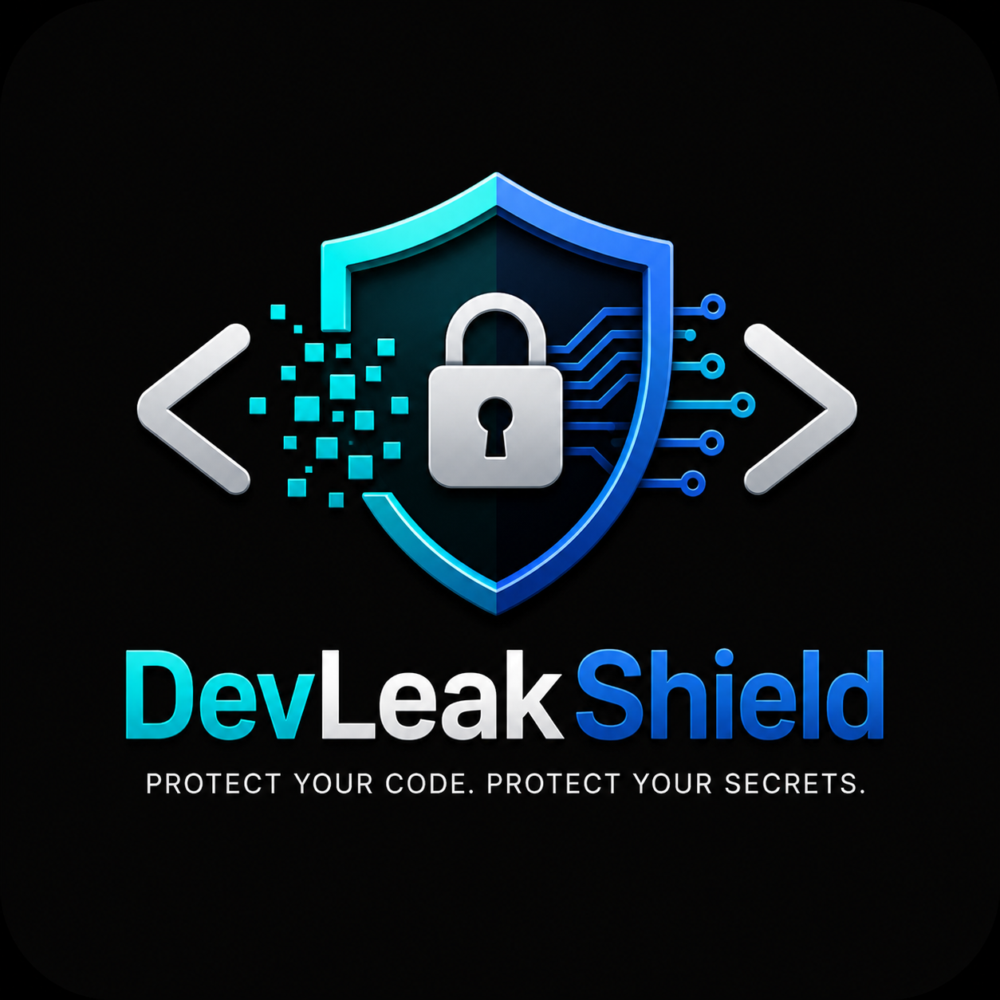

# DevLeakShield

> **Enterprise-grade AI-safe secret protection for VS Code**

DevLeakShield is a premium VS Code extension that prevents developers from accidentally leaking secrets (API keys, passwords, JWTs, tokens, credentials) to AI tools like ChatGPT, Claude, Gemini, GitHub Copilot, and Cursor.

---

## 🛡️ What It Does

- Multi-layer secret detection: regex, entropy, and context-aware analysis
- Confidence and risk scoring for every finding
- AI Prompt Firewall to analyze clipboard content before copy
- Git pre-commit secret scanning and commit blocking
- Enterprise policy engine with allowlists, denylists, and thresholds
- Secure vault storage with session and password-protected modes
- Workspace masking and secret restoration
- Security dashboard with risk distribution and historical analytics
- HTML and JSON security report generation

Architecture
- `src/core/`: business services for detection, policy, vault, firewall, reports, and dashboard
- `src/commands/`: VS Code command registration and orchestration
- `src/platform/`: workspace encryption and locking
- `src/ui/`: status bar and user-facing UI helpers
- `src/test/`: unit and integration test scaffolding

Getting started
1. Install dependencies: `npm install`
2. Compile: `npm run compile`
3. Run in VS Code extension host: press `F5`
4. Use the command palette or editor context menu commands to inspect clipboard, scan commits, and generate reports.
