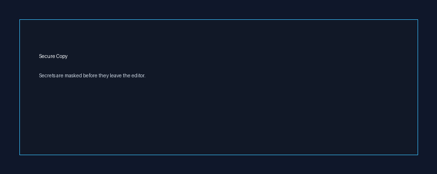

# 🛡️ DevLeakShield

> **AI Prompt Firewall & Secret Protection for Visual Studio Code**

DevLeakShield is a VS Code extension that helps developers avoid accidentally exposing sensitive information — API keys, passwords, JWT tokens, cloud credentials, database URLs, and private keys — while copying code, working with AI assistants, or scanning a workspace.

Designed for developers, cybersecurity learners, DevSecOps engineers, and teams who use modern AI-powered development workflows.



*Mockup demo illustrating the Secure Copy flow. Replace with a real screen recording of the extension before publishing to the Marketplace.*

---

## ⚠️ What this is (and isn't)

DevLeakShield is a **local, editor-based leak-reduction tool** — not a compliance platform, not a centralized secret manager, and not a guarantee against leaks. Please read this before relying on it:

- It **reduces the risk** of accidentally pasting secrets into clipboards or AI chat windows. It does not prevent secrets from existing in your code, and it cannot see what happens after data leaves your editor.
- Secrets are masked with reversible tokens (encrypted locally, restored on paste within VS Code) — this is **obfuscation-in-transit**, not permanent redaction. The real secret still exists on your machine.
- Detection is regex + entropy + heuristic based, like most secret scanners (e.g., gitleaks, truffleHog). It **will** produce false positives and **will** miss non-standard secret formats. Treat findings as a prompt to review, not as ground truth.
- It is **not** a substitute for proper secret management (vaults, environment separation, git history scanning, pre-commit hooks enforced at the CI level).

If you need guarantees for compliance or audit purposes, pair this with a server-side scanner (e.g., GitHub secret scanning, gitleaks in CI) rather than relying on DevLeakShield alone.

---

## 🚀 Install

Install directly from the Visual Studio Code Marketplace:

```bash
code --install-extension mathan0072007.dev-leak-shield
```

Or manually:

```text
VS Code
   ↓
Extensions
   ↓
Search "DevLeakShield"
   ↓
Install
```

DevLeakShield generates a local encryption key on first activation and starts protecting immediately — no config file is required for basic protection. Custom detection rules (below) do need one.

---

## 🔥 Why DevLeakShield?

Modern developers use AI tools every day:

```text
Developer
    |
    v
ChatGPT
Claude
Gemini
GitHub Copilot
Cursor
```

But copying source code can accidentally expose:

```text
API Keys
Passwords
Tokens
JWT Secrets
Cloud Keys
Database URLs
Private Keys
```

DevLeakShield adds a security layer before secrets leave your machine.

---

## 🔑 Automatic Security Initialization

After installation:

```text
Install Extension
        |
        v
Create Local Encryption Key
        |
        v
Store Key in Session-Scoped Local Storage
        |
        v
Enable Secret Protection
```

- Automatic encryption key generation, scoped to your local session
- No manual setup needed for basic protection
- If the key is missing or the session ends, a new key is generated and a new vault is created — meaning tokens from a previous session **cannot** be restored. This is expected behavior, not a bug: it limits how long a masked secret stays recoverable.

---

## 🧠 AI Prompt Firewall (AI Mode)

Helps you mask code before pasting it into AI tools:

```text
ChatGPT · Claude · Gemini · GitHub Copilot · Cursor · other AI assistants
```

Protection flow:

```text
Copied Code
     |
     v
Secret Scanner
     |
     v
Masked Output
```

Example:

Before:
```env
OPENAI_API_KEY=sk-real-secret-value
DATABASE_PASSWORD=root12345
```

After DevLeakShield:
```env
OPENAI_API_KEY=[REDACTED_TOKEN]
DATABASE_PASSWORD=[REDACTED_SECRET]
```

**Note:** AI Mode is a manual masking step you trigger on your selection — it does not automatically intercept every AI tool's input field. Always glance at what you're about to paste.

---

## 🔍 Secret Detection Engine

Detects:

```text
✔ OpenAI API Keys        ✔ GitHub Tokens         ✔ AWS Credentials
✔ Azure Secrets          ✔ Google Cloud Keys     ✔ Stripe Keys
✔ Slack Tokens           ✔ Discord Tokens        ✔ JWT Tokens
✔ SSH Private Keys       ✔ Database URLs         ✔ Passwords
✔ Bearer Tokens          ✔ High-entropy strings (generic)
```

Detection approach combines:
- regex matching
- context / keyword analysis
- entropy estimation

This means it isn't limited to exact known formats — but it also means it **will** occasionally flag non-secrets or miss unusual ones. Review findings rather than trusting them blindly.

---

## ⚡ Status Bar Controls

```text
● Secure Copy
● AI Mode
```

Click **Secure Copy** to enable/disable protected copy mode.
Click **AI Mode** to enable AI-safe masking on demand.

---

## 🖱️ Right Click Security Actions

Select code → Right click:

```text
DevLeakShield: Toggle Secure Copy Mode
DevLeakShield: Toggle AI Mode
DevLeakShield: Generate Security Report
DevLeakShield: Export Findings as JSON/CSV
```

Default keybindings: `Ctrl+C` (smart copy), `Ctrl+V` (smart paste) — remap in VS Code's keybinding settings if they conflict with your workflow.

---

## 🔐 Secure Copy Protection

Normal copy:
```text
Secret → Clipboard → Possible Leak
```

With DevLeakShield:
```text
Secret → Detection Engine → Local Encrypted Vault → Protected Token on Clipboard
```

Pasting the token **inside the same VS Code session** restores the original value. Pasting it into an external app or a different session pastes the masked token — that's the protection working as intended.

---

## 🔒 Secure Vault & Security Architecture

```text
Sensitive Data
      |
      v
AES-256-GCM Encryption
      |
      v
Local, Session-Scoped Storage
      |
      v
Placeholder Token (on clipboard)
```

- Encryption key is generated per session and stored locally — never synced, uploaded, or shared.
- Tokens only resolve within the session that created them.
- This protects against **accidental** exposure (a careless paste, a blind copy into a chat window). It is **not** designed to protect against a determined attacker with access to your local machine, since the key and vault live on that same machine.

See `SECURITY_ARCHITECTURE.md` for the full threat model and known limitations.

---

## 📊 Security Reports

Right click → `DevLeakShield: Generate Security Report`

```text
Security Report
Files scanned : 120
Secrets found : 5
Risk Level     : HIGH
Protection     : ACTIVE
```

Export as JSON or CSV via the command palette or right-click menu.

---

## 🧬 Custom Rules

Add your own regex patterns via a `.devleakshield.yml` file in your workspace root — useful for internal token formats the built-in rules don't cover:

```yaml
rules:
  - name: "internal-api-token"
    pattern: "itok_[a-zA-Z0-9]{32}"
    category: "custom"
```

This is read by `ConfigService.ts` and merged with the built-in rules in `SecretDetectionService.ts`.

---

## 📊 How this compares

| | DevLeakShield | gitleaks / truffleHog |
|---|---|---|
| Scope | Live editor, clipboard, AI workflows | Git history, CI pipelines |
| When it runs | Real-time, on copy/paste | On commit, scan, or CI job |
| Best for | Catching leaks *before* they're pasted anywhere | Catching leaks already committed |
| Team/CI integration | Not yet (local only) | Yes, mature |

They're complementary, not competing — DevLeakShield catches the moment *before* a leak happens; CI-based scanners catch what already got through.

---

## 📂 Architecture

```text
src/
 ├── extension.ts               # Entry point, command registration
 ├── SecretDetectionService.ts  # Core scanner (built-in + custom rules)
 ├── SecretClassifier.ts        # Categorizes findings
 ├── CryptoService.ts           # AES-256-GCM encrypt/decrypt
 ├── ConfigService.ts           # Loads .devleakshield.yml
 ├── ReportGenerator.ts         # JSON/CSV/HTML report output
 ├── NotificationService.ts     # User-facing notifications
 ├── LoggingService.ts          # Internal logging
 └── types.ts                   # Shared types
test/                           # Regression + detection benchmark tests
```

---

## 🛠️ Technology Stack

```text
TypeScript
Node.js
Visual Studio Code API
Node crypto (AES-256-GCM)
Mocha + Chai for tests
```

---

## 🧪 Development

```bash
git clone https://github.com/Mathan-2007/DevLeakShield.git
cd DevLeakShield
npm install
npm run compile
npm test
npx vsce package
```

---

## 🌟 Roadmap

Planned, not yet implemented — please don't assume these exist today:

```text
Pre-commit / Git hook integration
Enterprise Dashboard
Secret Rotation
SIEM Integration
Cloud Vault Support
GitHub Actions Security
Advanced AI Security Rules
Team Policy Management
```

---

## 🤝 Contributing

Security improvements, bug reports, and false-positive/false-negative samples are especially welcome — real-world examples are what improve detection accuracy over time.

```bash
git checkout -b feature-name
# make changes
# open a pull request
```

---

## 📜 License

MIT License

---

## 👨‍💻 Author

```text
Mathan S
Cybersecurity Enthusiast
Developer Security Tools
AI Security Research
```

GitHub: [github.com/Mathan-2007](https://github.com/Mathan-2007)

---

⭐ If DevLeakShield helps secure your workflow, consider starring the repo — and please report false positives/negatives via GitHub issues, they directly improve detection accuracy.